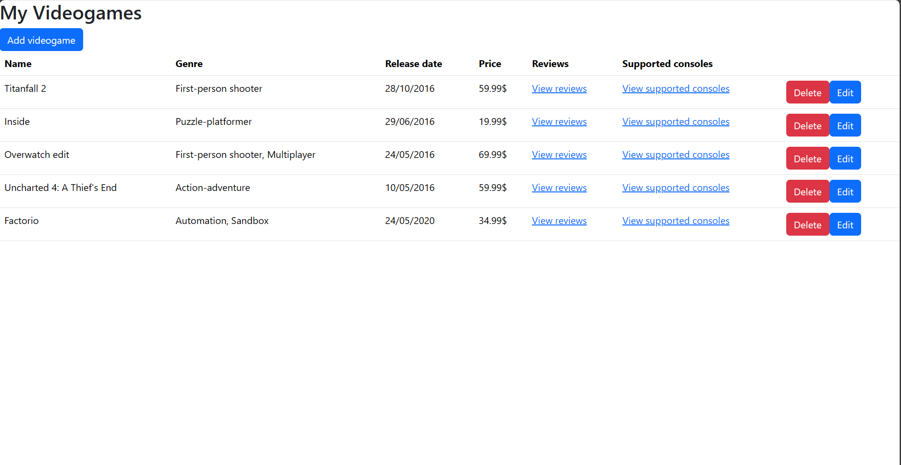
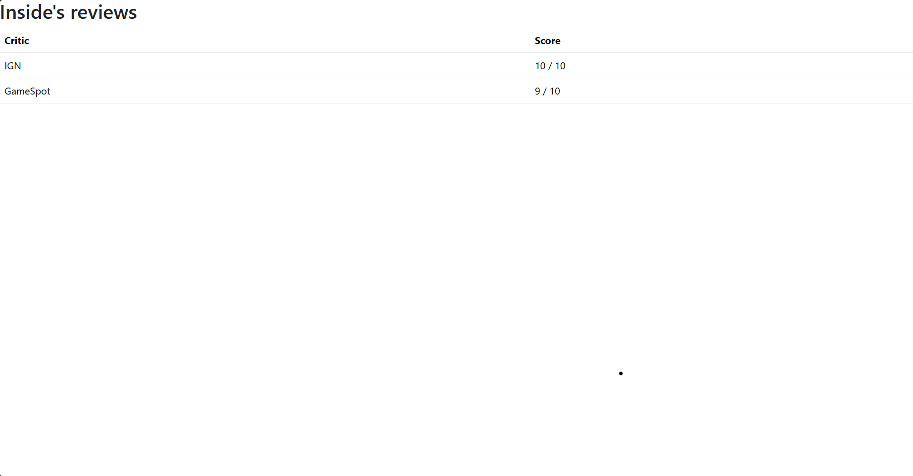
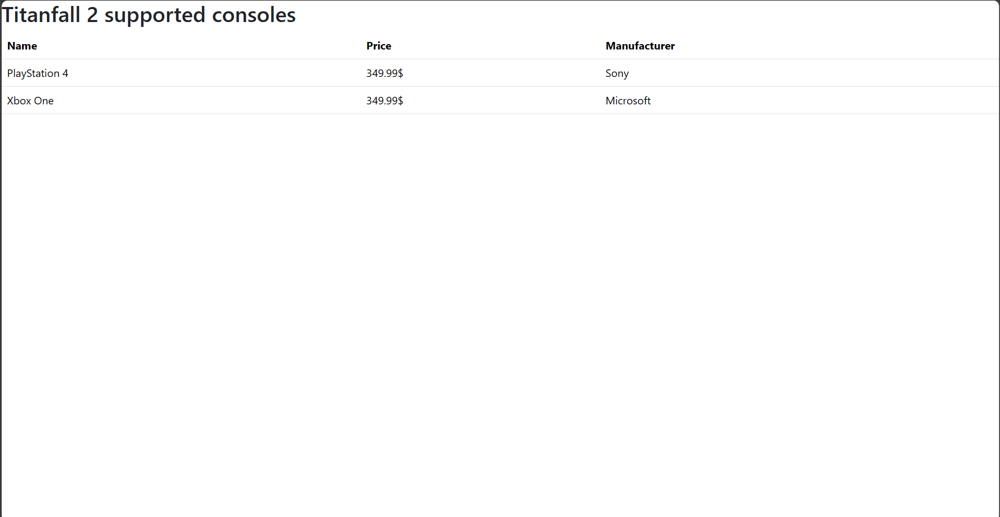
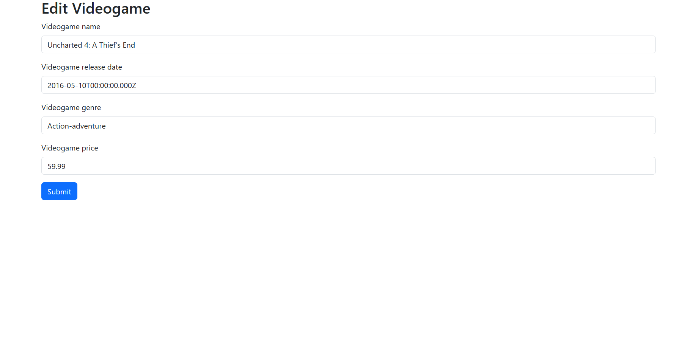

## Conținutul colecțiilor și exemple de funcții (find, insert, update, delete) apelate de către aplicația de backend

Continutul bazei de date se afla in fisiere [db.Videogames.json](./db.Videogames.json) si [db.Consoles.json](db.Consoles.json).

Exemple de funcții apelate de backend:

```js
app.get("/getVideogames", async (req, res) => {
    let collection = await database.collection("Videogames");
    let results = await collection.find({}).toArray();
    res.send(results).status(200);
  });

app.get("/getReviews/:videogameId", async (req, res) => {
    const videogameId = req.params.videogameId;

    let collection = await database.collection("Videogames");
    let results = await collection.findOne({ _id: new ObjectId(videogameId) })

    results = results.reviews;

    res.send(results).status(200);
});

app.get("/getConsoles/:videogameId", async (req, res) => {
    const videogameId = req.params.videogameId;

    let collection_games = await database.collection("Videogames");
    let game_results = await collection_games.findOne({ _id: new ObjectId(videogameId) })

    let supportedConsoleIds = game_results.supportedConsoles;

    let collection_consoles = await database.collection("Consoles");
    let results = await collection_consoles.find({ _id: { $in: supportedConsoleIds }}).toArray();

    res.send(results).status(200);
});

app.delete("/deleteVideogame/:videogameId", async (req, res) => {
    try {
        const query = { _id: new ObjectId(req.params.videogameId) };
    
        const collection = database.collection("Videogames");
        let result = await collection.deleteOne(query);
    
        res.send(result).status(200);
      } catch (err) {
        console.error(err);
        res.status(500).send("Error deleting videogame");
      }
})

app.patch("/editVideogame/:id", async (req, res) => {
    try {
    
      const { videogameId, newName, newReleaseDate, newGenre, newPrice} = req.body;

      const query = { _id: new ObjectId(videogameId) };
      const updates = {
        $set: {
            name: newName,
            releaseDate: new Date(newReleaseDate),
            genre: newGenre,
            releasePrice: Decimal128.fromString(newPrice),
        },
      };
  
      let collection = await database.collection("Videogames");
      let result = await collection.updateOne(query, updates);
      res.send(result).status(200);
    } catch (err) {
      console.error(err);
      res.status(500).send("Error updating videogame");
    }
  });

  app.post("/addVideogame", async (req, res) => {
    try {
      const { name, releaseDate, genre, price } = req.body;
      const newDocument =   {
                name: name,
                releaseDate: new Date(releaseDate),
                genre: genre,
                releasePrice: Decimal128.fromString(price),
                reviews: [],
                supportedConsoles: []
      }
      let collection = await database.collection("Videogames");
      let result = await collection.insertOne(newDocument);
      res.send(result).status(204);
    } catch (err) {
      console.error(err);
      res.status(500).send("Error adding videogame");
    }
  });
```

## Manual de utilizare



Pagina principală a aplicației permite vizualizarea colecției `Videogames`, adăugarea documentelor, precum și ștergerea / editarea acestora.

Folosind link-urile de pe rândurile `Reviews`, `Supported consoles` se pot vizualiza recenziile, respectiv consolele unui anumit joc.




Butoanele `Add videogame` și `Edit` deschid o pagină nouă care permite adăugarea / modificarea unui document din colecția `videogames`.

